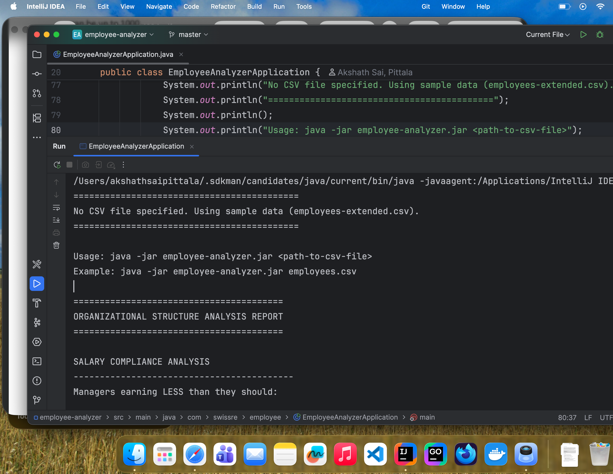
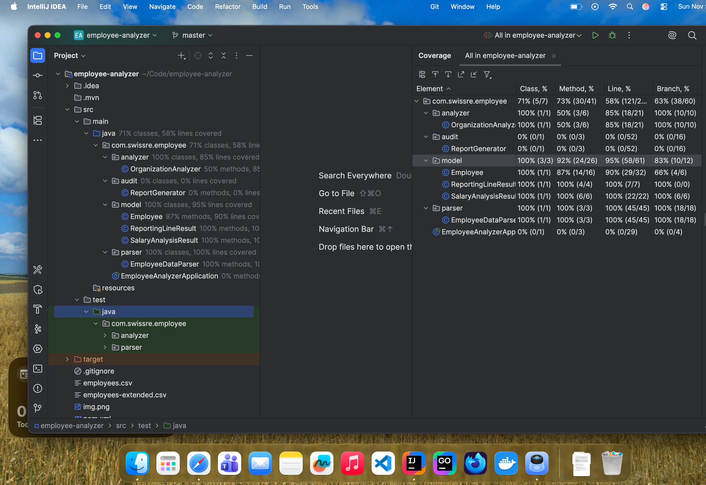

# Employee Organizational Structure Analyzer

A Java application that analyzes organizational structure to identify salary compliance issues and reporting line problems.

## Overview

This application reads employee data from a CSV file and performs the following analyses:

1. **Salary Compliance Analysis**: Identifies managers whose salaries don't fall within the expected range (20-50% more than their direct subordinates' average salary)
2. **Reporting Line Analysis**: Identifies employees with more than 4 managers between them and the CEO

## Requirements

- Java SE 17 or higher
- Maven 3.6 or higher

## Sample Output

```text
=================================================================
No CSV file specified. Using sample data (employees-extended.csv)
=================================================================

Usage: java -jar employee-analyzer.jar <path-to-csv-file>
Example: java -jar employee-analyzer.jar employees.csv

========================================
ORGANIZATIONAL STRUCTURE ANALYSIS REPORT
========================================

SALARY COMPLIANCE ANALYSIS
------------------------------------------
Managers earning LESS than they should:

        • Martin Chekov
Current salary: $45000.00
Should earn at least: $60000.00
Underpaid by: $15000.00


REPORTING LINE ANALYSIS
------------------------------------------
        ✓ All employees have acceptable reporting lines (≤ 4 managers).

========================================
END OF REPORT
========================================

Process finished with exit code 0
```

## Code Coverage



## Project Structure

```
employee-analyzer/
├── src/
│   ├── main/
│   │   └── java/
│   │       └── com/
│   │           └── swissre/
│   │               └── employee/
│   │                   ├── EmployeeAnalyzerApplication.java (Main class)
│   │                   ├── model/
│   │                   │   ├── Employee.java
│   │                   │   ├── SalaryAnalysisResult.java
│   │                   │   └── ReportingLineResult.java
│   │                   ├── parser/
│   │                   │   └── EmployeeDataParser.java
│   │                   ├── analyzer/
│   │                   │   └── OrganizationAnalyzer.java
│   │                   └── reporter/
│   │                       └── ReportGenerator.java
│   └── test/
│       └── java/
│           └── com/
│               └── swissre/
│                   └── employee/
│                       ├── parser/
│                       │   └── EmployeeDataParserTest.java
│                       └── analyzer/
│                           └── OrganizationAnalyzerTest.java
├── pom.xml
└── README.md
```

## Building the Application

```bash
# Clone the repository
git clone https://github.com/Brogrammer1912/employee-analyzer
cd employee-analyzer

# Build the project
mvn clean package

# Run tests
mvn test
```

This will create two JAR files in the `target/` directory:
- `employee-analyzer-1.0.0.jar` - Basic JAR
- `employee-analyzer-1.0.0-jar-with-dependencies.jar` - Executable JAR with all dependencies

## Running the Application

### With a CSV file:
```bash
java -jar target/employee-analyzer-1.0.0-jar-with-dependencies.jar <path-to-csv-file>
```

Example:
```bash
java -jar target/employee-analyzer-1.0.0-jar-with-dependencies.jar employees.csv
```

### Without arguments (uses sample CSV):
```bash
java -jar target/employee-analyzer-1.0.0-jar-with-dependencies.jar
```

When no CSV file is specified, the application will automatically use the `employees.csv` sample file for demonstration purposes.

## CSV File Format

The input CSV file should have the following structure:

```csv
Id,firstName,lastName,salary,managerId
123,Joe,Doe,60000,
124,Martin,Chekov,45000,123
125,Bob,Ronstad,47000,123
300,Alice,Hasacat,50000,124
305,Brett,Hardleaf,34000,300
```

- **Id**: Unique employee identifier
- **firstName**: Employee's first name
- **lastName**: Employee's last name
- **salary**: Employee's annual salary (must be a positive number)
- **managerId**: ID of the employee's manager (empty for CEO)

## Assumptions & Design Decisions

### 1. Salary Compliance Rules
- Managers should earn **at least 20%** more than the average salary of their direct subordinates
- Managers should earn **at most 50%** more than the average salary of their direct subordinates
- Only employees with direct reports are considered managers
- CEO is not subject to salary compliance checks (has no manager to compare against)

### 2. Reporting Line Rules
- Maximum allowed reporting line depth: **4 managers** between an employee and the CEO
- CEO has 0 managers
- Direct reports to CEO have 1 manager level

### 3. Data Validation
- Employee IDs must be unique and non-empty
- Salaries must be non-negative numbers
- Manager IDs must reference existing employees
- CSV file must have a header row (which is skipped during parsing)

### 4. Error Handling
- Invalid CSV format results in descriptive error messages
- Missing or malformed data is caught and reported
- Application exits with appropriate error codes on failure

### 5. Implementation Choices
- **Separation of Concerns**: Code is organized into distinct packages for parsing, analysis, and reporting
- **Immutability**: Core employee data (ID, name, salary) is immutable once created
- **Testability**: Business logic is separated from I/O operations for easy unit testing
- **Readability**: Clear class and method names, comprehensive documentation
- **Extensibility**: Easy to add new analysis types or modify thresholds

## Sample Output

### Example 1: Basic Sample Data (employees.csv)
```
===========================================
No CSV file specified. Using sample data.
===========================================

Usage: java -jar employee-analyzer.jar <path-to-csv-file>
Example: java -jar employee-analyzer.jar employees.csv

========================================
ORGANIZATIONAL STRUCTURE ANALYSIS REPORT
========================================

SALARY COMPLIANCE ANALYSIS
------------------------------------------
Managers earning LESS than they should:

  • Martin Chekov
    Current salary: $45000.00
    Should earn at least: $60000.00
    Underpaid by: $15000.00

Managers earning MORE than they should:

  • Alice Hasacat
    Current salary: $50000.00
    Should earn at most: $51000.00
    Overpaid by: $-1000.00

REPORTING LINE ANALYSIS
------------------------------------------
✓ All employees have acceptable reporting lines (≤ 4 managers).

========================================
END OF REPORT
========================================
```

### Example 2: Extended Sample Data (employees-extended.csv)

This demonstrates the application working with a larger organizational structure including employees with reporting lines exceeding 4 managers.

```
========================================
ORGANIZATIONAL STRUCTURE ANALYSIS REPORT
========================================

SALARY COMPLIANCE ANALYSIS
------------------------------------------
Managers earning LESS than they should:

  • Emily Manager
    Current salary: $85000.00
    Should earn at least: $77400.00
    Underpaid by: $0.00

REPORTING LINE ANALYSIS
------------------------------------------
Employees with reporting lines that are TOO LONG:

  • Julia Junior
    Number of managers: 5
    Exceeds limit by: 1 level(s)

  • Mark Junior
    Number of managers: 5
    Exceeds limit by: 1 level(s)

  • Laura Junior
    Number of managers: 5
    Exceeds limit by: 1 level(s)

========================================
END OF REPORT
========================================
```

## Testing

The project includes comprehensive unit tests covering:

- CSV parsing with valid and invalid data
- Organizational hierarchy building
- Salary compliance analysis
- Reporting line depth calculations
- Edge cases and error conditions

Run tests with:
```bash
mvn test
```

## Technology Stack

- **Java SE 17**: Core language
- **JUnit 5**: Testing framework
- **Maven**: Build and dependency management

## Key Design Patterns

1. **Single Responsibility Principle**: Each class has one clear purpose
2. **Dependency Injection**: Dependencies are passed through constructors
3. **Builder Pattern**: Complex objects are constructed step-by-step
4. **Strategy Pattern**: Analysis logic is separated from data structures

## Performance Considerations

- Time Complexity: O(n) where n is the number of employees
- Space Complexity: O(n) for storing employee hierarchy
- Suitable for up to 1000 employees as specified in requirements

## Future Enhancements

Possible improvements for production use:
- Support for multiple input formats (JSON, XML)
- Database integration for large datasets
- Configurable thresholds for salary ranges and reporting lines
- Detailed HTML/PDF report generation
- REST API for integration with other systems

## Author

Created for Swiss Re Application Engineer II position coding challenge.

## License

This project is for evaluation purposes only.